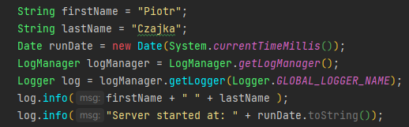
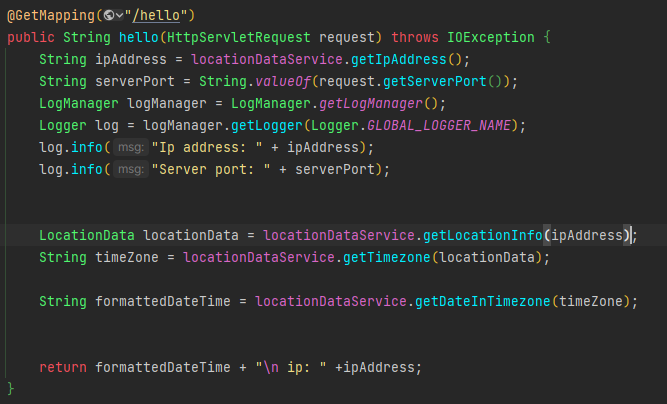
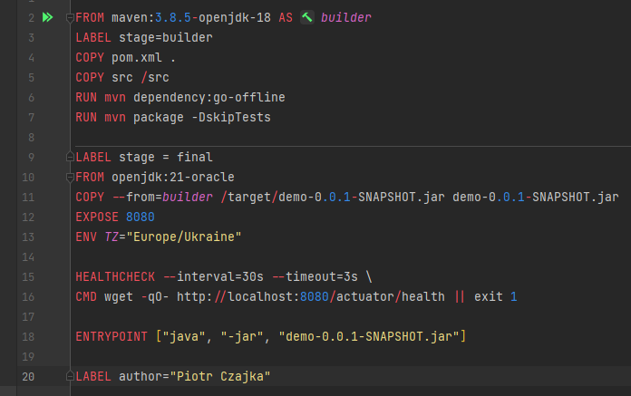
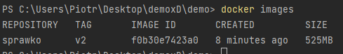
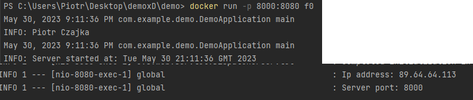
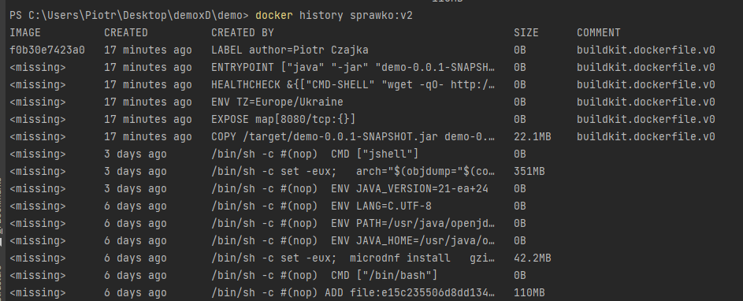

# Sprawozdanie Piotr Czajka
## Kod aplikacji->zad.1
LocationDataController wystawia endpoint, dzięki któremu użytkownik może dowiedzieć się o swoim ip oraz aktualnej godzinie
  w swojej strefie czasowej. W przypadku budownia aplikacji bez użycia dockera będzie to http://localhost:8080/hello
  do sprawdzenia ip wykorzystuje http://checkip.dyndns.org/
  do sprawdzenia strefy czasowej na podstawie ip wykorzystuje zewnętrzne api i z użyciem GSONa pobieram potrzebne mi dane
  
  Na powyższym obrazku zostają pobrane dane o godzinie startu serwera, imieniu oraz nazwisku autora i zostaje to odłożone do logów
  
  na powyższym obrazku zostają pobrane informacje o ip, porcie na którym nasłuchuje serwer, strefie czasowej oraz godzinie w danej strefie
## Zadanie 2
Kod pliku dockerfile, został ustawiony inny timezone dla obrazu niż tz użytkownikaS
  

## Zadanie 3
a) docker build -f Dockerfile -t sprawko:v2 .
  -f pozwala określić nazwę pliku Dockerfile (domyślnie Dockerfile)
  -t nadanie tagu obrazowi (wersjonowanie obrazu)
  . oznacza, że wszystkie pliki i folderu z tego katalogu będą dostępne do budowy obrazu
  b) aby uruchomić zbudowany kontener najpierw sprawdzę jego id za pomocą docker images

  na podstawie tego uruchamiam obraz używając polecenia: docker run -p 8000:8080 f0 
  -p mapuje port hosta na port kontenera
  f0 to początek image_id (jeśli jest wystarczająco unikalna to docker to rozpozna, nie trzeba pisać całego image_id)
  c) w konsoli są odkładane logi z pkt 1a)  

  informacje o warstwach są wyświetlane za pomocą docker history nazwa_obrazu
